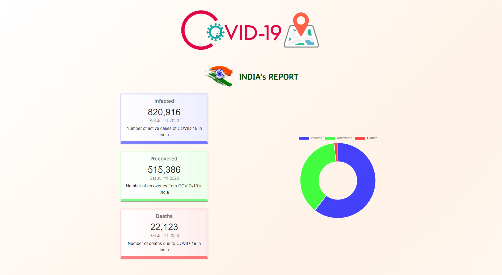
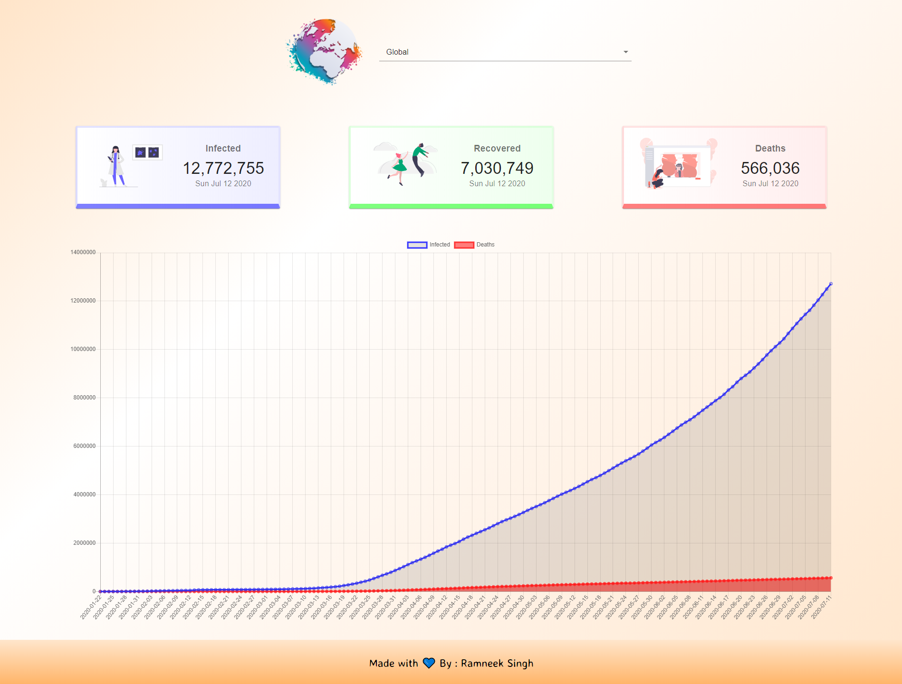
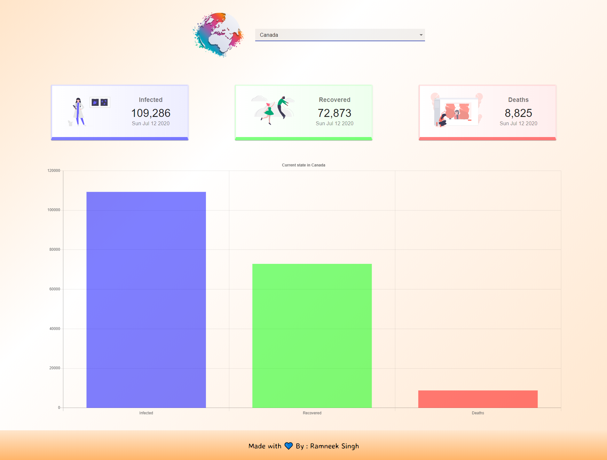

# Covid-19 Tracker

[](https://app.netlify.com/sites/covid-19-tracker-india-world/deploys)

A real-time tracker that shows the updated count of Covid-19 stats across the globe. To have a look on long-term stats, it plots the line chart of the Covid-19 report globally. It also plots the related graphs according to different countries you want to survey about. 

[View live version](https://covid-19-tracker-india-world.netlify.app/)


### Screenshots

<p align="center"></p>

<p align="center">&nbsp;&nbsp;&nbsp;&nbsp;</p>

## Built With

- [ReactJS](https://reactjs.org/)

## Setup

Clone the repository, then run

```
npm install
```

To run the app

```
npm start
```


## Contributing

Please read [CONTRIBUTING.md](CONTRIBUTING.md) for details on the process for submitting pull requests to us.

## License

This project is licensed under the MIT License - see the [LICENSE](LICENSE) file for details

